# Desplegament amb AWS Academy - Portafolis Astro

## Introducció

Utilitzarem **AWS Academy** per desplegar el portafolis web creant una imatge Docker del projecte Astro i desplegant-la en un contenidor AWS. Aquest enfocament us permetrà aprendre tecnologies cloud reals utilitzades a la indústria.

## Prerequisits

### 1. Accés AWS Academy
- Compte AWS Academy activat pel centre de formació
- Accés al AWS Academy Learner Lab
- Crèdits AWS assignats per l'instructor

### 2. Eines Necessàries
- Docker Desktop instal·lat localment
- AWS CLI configurat
- Compte GitHub amb el projecte Astro

## Arquitectura de Desplegament

```mermaid
graph TB
    A[Codi Astro] --> B[Build Local]
    B --> C[Crear Imatge Docker]
    C --> D[Push a ECR]
    D --> E[Deploy a ECS/EC2]
    E --> F[Load Balancer]
    F --> G[Domini Públic]
```



## Pas 1: Configuració del Dockerfile

Creem un `Dockerfile` optimitzat per Astro:

```dockerfile
# Dockerfile
FROM node:18-alpine AS builder

WORKDIR /app
COPY package*.json ./
RUN npm ci --only=production

COPY . .
RUN npm run build

# Imatge de producció
FROM nginx:alpine

# Copiar els fitxers build d'Astro
COPY --from=builder /app/dist /usr/share/nginx/html

# Configuració Nginx per SPA
COPY nginx.conf /etc/nginx/nginx.conf

EXPOSE 80

CMD ["nginx", "-g", "daemon off;"]
```

## Pas 2: Configuració Nginx

Crear `nginx.conf` per servir correctament l'aplicació Astro:

```nginx
events {
    worker_connections 1024;
}

http {
    include       /etc/nginx/mime.types;
    default_type  application/octet-stream;

    server {
        listen 80;
        server_name localhost;
        root /usr/share/nginx/html;
        index index.html;

        # Gestió d'assets estàtics
        location ~* \.(js|css|png|jpg|jpeg|gif|ico|svg|woff|woff2)$ {
            expires 1y;
            add_header Cache-Control "public, immutable";
        }

        # Fallback per a rutes Astro
        location / {
            try_files $uri $uri/ /index.html;
        }

        # Headers de seguretat
        add_header X-Frame-Options "SAMEORIGIN" always;
        add_header X-Content-Type-Options "nosniff" always;
        add_header Referrer-Policy "no-referrer-when-downgrade" always;
    }
}
```

## Pas 3: Scripts d'Automatització

Crear `deploy.sh` per automatitzar el procés:

```bash
#!/bin/bash

# Variables
AWS_REGION="us-east-1"
ECR_REPO="portafolis-astro"
IMAGE_TAG="latest"
CLUSTER_NAME="portafolis-cluster"
SERVICE_NAME="portafolis-service"

echo "🚀 Iniciant desplegament AWS..."

# 1. Build de la imatge Docker
echo "📦 Creant imatge Docker..."
docker build -t $ECR_REPO:$IMAGE_TAG .

# 2. Login a ECR
echo "🔐 Login a AWS ECR..."
aws ecr get-login-password --region $AWS_REGION | docker login --username AWS --password-stdin $ECR_URI

# 3. Tag i push de la imatge
echo "📤 Pujant imatge a ECR..."
docker tag $ECR_REPO:$IMAGE_TAG $ECR_URI:$IMAGE_TAG
docker push $ECR_URI:$IMAGE_TAG

# 4. Update del servei ECS
echo "🚀 Desplegant a ECS..."
aws ecs update-service --cluster $CLUSTER_NAME --service $SERVICE_NAME --force-new-deployment

echo "✅ Desplegament completat!"
```

## Pas 4: Configuració AWS Academy

### 4.1 Accedir al Lab Environment

1. **Login AWS Academy**
   - Accedir a la plataforma AWS Academy
   - Iniciar el Learner Lab assignat
   - Obtenir credencials temporals

2. **Configurar AWS CLI**
```bash
aws configure set aws_access_key_id YOUR_ACCESS_KEY
aws configure set aws_secret_access_key YOUR_SECRET_KEY
aws configure set aws_session_token YOUR_SESSION_TOKEN
aws configure set region us-east-1
```

### 4.2 Crear Repositori ECR

```bash
# Crear repositori per les imatges Docker
aws ecr create-repository --repository-name portafolis-astro --region us-east-1

# Obtenir URL del repositori
ECR_URI=$(aws ecr describe-repositories --repository-names portafolis-astro --query 'repositories[0].repositoryUri' --output text)
echo "ECR URI: $ECR_URI"
```

### 4.3 Configurar ECS Cluster

```bash
# Crear cluster ECS
aws ecs create-cluster --cluster-name portafolis-cluster

# Crear task definition
aws ecs register-task-definition --cli-input-json file://task-definition.json
```

Crear `task-definition.json`:

```json
{
  "family": "portafolis-task",
  "networkMode": "awsvpc",
  "requiresCompatibilities": ["FARGATE"],
  "cpu": "256",
  "memory": "512",
  "executionRoleArn": "arn:aws:iam::ACCOUNT-ID:role/ecsTaskExecutionRole",
  "containerDefinitions": [
    {
      "name": "portafolis-container",
      "image": "ECR_URI:latest",
      "portMappings": [
        {
          "containerPort": 80,
          "protocol": "tcp"
        }
      ],
      "essential": true,
      "logConfiguration": {
        "logDriver": "awslogs",
        "options": {
          "awslogs-group": "/ecs/portafolis",
          "awslogs-region": "us-east-1",
          "awslogs-stream-prefix": "ecs"
        }
      }
    }
  ]
}
```

### 4.4 Crear Load Balancer i Grup de Destinació

```bash
# Crear Application Load Balancer
aws elbv2 create-load-balancer \
  --name portafolis-alb \
  --subnets subnet-12345 subnet-67890 \
  --security-groups sg-12345

# Crear target group
aws elbv2 create-target-group \
  --name portafolis-targets \
  --protocol HTTP \
  --port 80 \
  --vpc-id vpc-12345 \
  --target-type ip
```

## Pas 5: Desplegament del Servei

```bash
# Crear servei ECS amb Load Balancer
aws ecs create-service \
  --cluster portafolis-cluster \
  --service-name portafolis-service \
  --task-definition portafolis-task:1 \
  --desired-count 1 \
  --launch-type FARGATE \
  --network-configuration "awsvpcConfiguration={subnets=[subnet-12345,subnet-67890],securityGroups=[sg-12345],assignPublicIp=ENABLED}" \
  --load-balancers targetGroupArn=TARGET_GROUP_ARN,containerName=portafolis-container,containerPort=80
```

## Pas 6: Configuració del Domini

### 6.1 Route 53 (Opcional)
```bash
# Crear hosted zone per al domini personalitzat
aws route53 create-hosted-zone --name votredomini.com --caller-reference $(date +%s)

# Crear record A apuntant al Load Balancer
aws route53 change-resource-record-sets --hosted-zone-id Z123456 --change-batch file://dns-record.json
```

### 6.2 CloudFront (CDN)
```bash
# Crear distribució CloudFront
aws cloudfront create-distribution --distribution-config file://cloudfront-config.json
```

## Monitorització i Logs

### CloudWatch Logs
```bash
# Crear log group
aws logs create-log-group --log-group-name /ecs/portafolis

# Veure logs en temps real
aws logs tail /ecs/portafolis --follow
```

### Mètriques CloudWatch
- CPU i memòria del contenidor
- Requests per segon al Load Balancer
- Temps de resposta de l'aplicació
- Estat de salut dels targets

## Workflow Complet per l'Alumnat

### 1. Desenvolupament Local
```bash
# Clone del repositori
git clone https://github.com/student/portafolis-astro.git
cd portafolis-astro

# desenvolupament
npm install
npm run dev

# Testing local
npm run build
npm run preview
```

### 2. Preparació per Desplegament
```bash
# Crear Dockerfile i nginx.conf
# Crear scripts de desplegament
# Commit dels canvis
git add .
git commit -m "feat: add Docker configuration for AWS deployment"
git push origin main
```

### 3. Desplegament AWS
```bash
# Executar script de desplegament
chmod +x deploy.sh
./deploy.sh

# Verificar desplegament
aws ecs describe-services --cluster portafolis-cluster --services portafolis-service
```

## Costos Estimats AWS Academy

### Recursos Utilitzats
- **ECS Fargate**: ~$0.04/hora per tasca
- **Application Load Balancer**: ~$0.025/hora
- **ECR Storage**: ~$0.10/GB/mes
- **CloudWatch Logs**: ~$0.50/GB
- **Data Transfer**: Primer 1GB gratuït

### Cost Mensual Estimat: ~$20-30 per estudiant

## Troubleshooting Comú

### Error: "Task stopped unexpectedly"
```bash
# Revisar logs del contenidor
aws logs get-log-events --log-group-name /ecs/portafolis --log-stream-name LOG_STREAM_NAME

# Verificar configuració de la tasca
aws ecs describe-tasks --cluster portafolis-cluster --tasks TASK_ARN
```

### Error: "Load Balancer unhealthy targets"
```bash
# Verificar health check
aws elbv2 describe-target-health --target-group-arn TARGET_GROUP_ARN

# Verificar security groups
aws ec2 describe-security-groups --group-ids sg-12345
```

### Error: "ECR login failed"
```bash
# Renovar token ECR
aws ecr get-login-password --region us-east-1 | docker login --username AWS --password-stdin ECR_URI
```

## Avantatges d'AWS Academy vs Netlify

### Formatius
- **Experiència cloud real**: AWS és líder del mercat
- **Skills transferibles**: Coneixements aplicables professionalment
- **Arquitectura complexa**: Comprensió de microserveis i contenidors
- **DevOps practices**: CI/CD, IaC, monitorització

### Tècnics
- **Escalabilitat**: Auto-scaling automàtic
- **Disponibilitat**: Multi-AZ deployment
- **Seguretat**: IAM, VPC, Security Groups
- **Observabilitat**: CloudWatch, X-Ray, logs centralizats

### Professionals
- **Certificacions AWS**: Preparació per a certificacions oficials
- **Portfolio empresarial**: Experiència valorada pels empleadors
- **Tecnologies modernes**: Docker, Kubernetes, serverless
- **Mindset cloud**: Pensament distribuït i resilient

Aquest enfocament prepara l'alumnat per a roles DevOps i Cloud Engineering mentre desplega el seu portafolis de manera professional! 🚀 