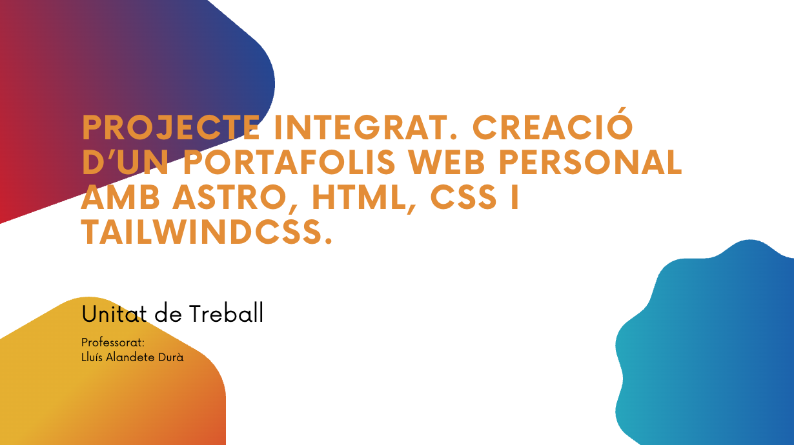

# UT8. Projecte integrat - Portafolis Web amb Astro, HTML, CSS i TailwindCSS

## Descripció

Projecte final del mòdul **Disseny d'Interfícies Web**, on l'alumnat desenvolupa un portafolis web professional. S'utilitzen tecnologies modernes com **Astro**, **TailwindCSS**, **HTML** i **CSS**, tot aplicant criteris d'accessibilitat, usabilitat i bones pràctiques. L'activitat integra control de versions amb **GitHub**, desplegament a **AWS Academy** amb contenidors Docker, i validació d'accessibilitat i rendiment amb eines com **Lighthouse**. [Descarregar PDF Unitat de Treball](assets/ut8.pdf)

## 🎥 [Vídeo explicant el contingut desenvolupat]()
## 🎥 [Vídeo de presentació del projecte](https://youtu.be/zDRAUWkiAdM)
## 🎬 [Canva de presentació del projecte](https://www.canva.com/design/DAGdsvvGZqU/1-vbsQxQ5QyePlF1tuFubw/edit?utm_content=DAGdsvvGZqU&utm_campaign=designshare&utm_medium=link2&utm_source=sharebutton)

## Justificació

Aquesta unitat consolida tots els coneixements adquirits al llarg del curs, permetent a l'alumnat aplicar-los en un projecte real. Fomenta l'autonomia, la creativitat i la col·laboració, i prepara per a situacions típiques del món laboral del desenvolupament web.

## Context

| Característica | Detall |
|---------------|---------|
| Cicle Formatiu | Desenvolupament d'Aplicacions Web |
| Curs | 2n de DAW |
| Mòdul | Disseny d'Interfícies Web (DIW) |
| Càrrega horària | 36 hores (12 sessions de 3h) |
| Temporalització | 2n trimestre (6 setmanes, 6h/setmana) |
| Pes avaluatiu | 25% |

## Documentació Completa

### 📋 Planificació i Organització
- **[Planificació Detallada de Sessions](planificacio-sessions.md)** - Cronograma complet amb temporització i activitats
- **[Indicacions Específiques](indicacions-especifiques.md)** - Guia pas a pas per l'alumnat

### 📊 Avaluació
- **[Sistema d'Avaluació Detallat](avaluacio.md)** - Rúbriques, instruments i criteris de qualificació

### 🛠️ Recursos i Eines
- **[Recursos Generats pel Professor](recursos-generats.md)** - Vídeos, presentacions, formularis i materials originals
- **[Eines Descobertes i Recomanacions](eines-descobertes.md)** - Anàlisi d'eines noves i valoracions

## Resultats d'aprenentatge i criteris d'avaluació

| Resultat d'aprenentatge        | Percentatge | Sessions             |
| ------------------------------ | ----------- | -------------------- |
| RA1. Planificació d'interfície | 15%         | 1, 2                 |
| RA2. Estils i disseny visual   | 35%         | 1, 3, 4, 5, 9, 10    |
| RA3. Contingut multimèdia      | 20%         | 4, 5                 |
| RA4. Interactivitat            | 10%         | 4, 5, 6, 7           |
| RA5. Accessibilitat            | 10%         | 3, 4, 5, 7, 8, 9, 10 |
| RA6. Usabilitat                | 10%         | 2, 3, 6, 7, 8, 9, 10 |

## Criteris d'avaluació

**RA1: Planifica la creació d'interfícies web valorant i aplicant especificacions de disseny**

* Reconeixement de la importància de la comunicació visual.
* Selecció adequada de colors i tipografies per a pantalla.
* Aplicació de guies d'estil en desenvolupament web.
* Creació i ús de plantilles de disseny.

**RA2: Crea interfícies web homogenis definint i aplicant estils**

* Modificació correcta d'etiquetes HTML.
* Definició i aplicació d'estils globals en fulls externs.
* Creació de fulls d'estil alternatius.
* Ús i manteniment de la guia d'estil.

**RA3: Prepara arxius multimèdia per a la Web, analitzant-ne les característiques i manejant eines específiques**

* Identificació de drets d'autor en material multimèdia.
* Selecció de formats adequats d'imatge, àudio i vídeo.
* Ús d'eines per generar contingut multimèdia.
* Importació/exportació de contingut multimèdia.

**RA4: Integra contingut multimèdia en documents web valorant-ne l'aportació i seleccionant adequadament els elements interactius**

* Anàlisi de tecnologies per contingut multimèdia i interactiu.
* Integració d'elements multimèdia en documents web.
* Aplicació d'interactivitat als elements del web.

**RA5: Desenvolupa interfícies web accessibles, analitzant les pautes establertes i aplicant tècniques de verificació**

* Identificació de pautes d'accessibilitat (WCAG).
* Verificació del nivell de conformitat.
* Visualització amb diferents navegadors i tecnologies.

**RA6: Desenvolupa interfícies web amigables analitzant i aplicant les pautes d'usabilitat establertes**

* Ús d'estàndards en la creació de documents web.
* Adequació de la interfície als objectius i usuaris.
* Verificació de la navegació amb diferents dispositius.
* Validació de la usabilitat amb eines com Lighthouse.

## Competències

### Professionals

* Desenvolupar interfícies web segons guies d'estil.
* Crear i integrar multimèdia amb eines específiques.
* Analitzar accessibilitat, usabilitat i interactivitat.
* Aplicar metodologies de control de versions (Git).

### Ocupabilitat

* Treball en equip, revisió crítica, adaptabilitat.
* Cultura de la qualitat i autoavaluació.
* Aplicació de disseny universal i bones pràctiques.

## Continguts

1. Planificació visual, wireframes i guies d'estil
2. Maquetació HTML semàntica i CSS/Tailwind
3. Accessibilitat i WCAG
4. Contingut multimèdia: imatges, vídeos, drets d'autor
5. Interactivitat: formularis, animacions
6. Desplegament amb AWS Academy utilitzant Docker i ECS
7. Avaluació amb Lighthouse, validacions i QA entre iguals

## Recursos

* Ordinadors amb Node.js i Visual Studio Code
* Accés a GitHub, AWS Academy i Docker Desktop
* Moodle amb materials, vídeos, enquestes i tutorials
* Figma, Lighthouse, Microsoft Planner i Whiteboard

### Backup del Moodle

En cas que es vullga gastar Moodle per a gestionar les tasques del curs, es pot descarregar el backup complet amb tots els materials, activitats i configuracions des del següent enllaç:

* **[Descarregar Backup Moodle UT8](assets/backup-moodle-daw-diw-unitat-de-treball-projecte-integrat-portafolis.mbz)** - Backup complet del curs amb materials, fòrums, tasques i configuracions
* **Instruccions d'instal·lació**: El fitxer `.mbz` es pot restaurar directament des del panell d'administració de Moodle > Restaurar curs
* **Requisits**: Moodle 4.0 o superior amb permisos d'administració

## Metodologia

* **ABP**: desenvolupament d'un projecte final funcional
* **Flipped Classroom**: continguts prèvis per vídeos
* **Pràctica guiada**: aplicació directa amb suport del docent
* **Feedback entre iguals (QA)** i treball col·laboratiu
* **Sessions de revisió crítica i ajustos finals**

## Seqüència

1. Presentació i configuració tècnica (Astro, Tailwind, GitHub)
2. Planificació visual (wireframes, guies d'estil)
3. Header i Footer accessibles i responsius
4. Homepage amb Hero Section i multimèdia
5. Secció de projectes i estils visuals
6. Desplegament AWS i containerització (casa)
7. Formulari de contacte funcional amb API
8. QA entre parelles i revisió crítica
9. Sprint 1: aplicació de millores
10. Sprint 2: ajustos finals i validacions
11. Presentacions i coavaluació final

**🗓️ [Veure Planificació Detallada](planificacio-sessions.md)**

## Adaptacions

En cas que siga necessari, es realitzaran adaptacions metodològiques, temporals o de recursos per atendre les necessitats educatives específíques (NESE) o la diversitat funcional de l'alumnat.

Aquestes adaptacions podran incloure:

* Ajustos en els terminis de lliurament.
* Suport personalitzat en l'ús de tecnologies (Astro, GitHub, TailwindCSS).
* Materials complementaris o simplificats.
* Avaluació alternativa basada en evidències concretes.
* Priorització de l'accessibilitat i usabilitat en les tasques.

Les adaptacions es concretaran de manera individual, tenint en compte els informes psicopedagògics i en coordinació amb el departament d'orientació.

