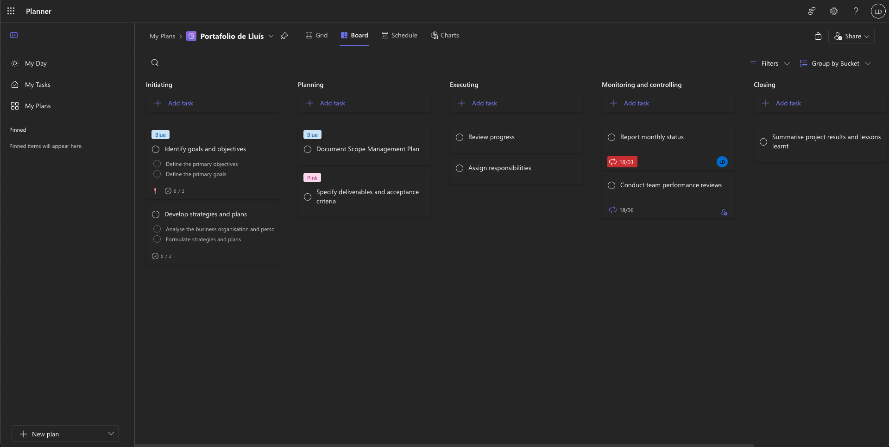

# Recursos Generats pel Professor

## Vídeos Tutorials

### 1. Sèrie "Portafolis Professional amb Astro"

**Finalitat**: Introducció i aprenentatge guiat

| Vídeo | Durada | Contingut|
|-------|--------|-----------|
| [Exemple de portafolis fet amb Astro + Tailwind](https://www.youtube.com/watch?v=HEMvsJTBweY) | 1h 45 min | Tutorial pas a pas per a configurar Astro |
| [Taller de Figma per a desenvolupadors](https://www.youtube.com/watch?v=p53yCQoS6qg) | 2h | Taller de com gastar Figma per a crear guia d'estil |
| [Com utilitzar Responsively](https://youtu.be/fHvdPzbZ9pU) | 1 min | Com gastar Responsively per a visualitzar el portafolis en diferents dimensions |
| [CSS Nesting Natiu](https://youtu.be/BWg5NImmw_Y) | 1 min | Contingut propi explicant el concepte de nesting |
| [Com utilitzar Lighthouse en Chrome](https://youtu.be/83tYGnd3zss) | 1 min | Com generar els resultats per a optimitzar el portafolis |
| [Desplegament AWS amb Docker](https://www.youtube.com/watch?v=zQyrhjEAqLs) | 2h | Tutorial com funciona AWS |

### 2. Píldores Formatives

**Finalitat**: Reforç i resolució de dubtes

- [Documentació Astro](https://docs.astro.build/es/getting-started/)
- [Documentació TailwindCSS](https://tailwindcss.com/docs/installation/framework-guides/astro)
- [Git: Bones Pràctiques](https://code.visualstudio.com/docs/sourcecontrol/intro-to-git)
- [Lighthouse: Interpretació de Resultats](https://developer.chrome.com/docs/lighthouse/overview)

## Presentacions Interactives

### 1. Material Introductori

**Presentació Principal**: [Presentació: Projecte Portafolis Web](https://www.canva.com/design/DAGdsvvGZqU/1-vbsQxQ5QyePlF1tuFubw/edit?utm_content=DAGdsvvGZqU&utm_campaign=designshare&utm_medium=link2&utm_source=sharebutton)

- **Eina**: Canva
- **Finalitat**: Motivació i contextualització inicial
- **Contingut**: Exemples inspiradors, mercat laboral, objectives

### 2. Guies Visuals

**Guia d'Estil**: [Design System Exemple](https://www.figma.com/community/website-templates/portfolio?editor_type=sites)

- **Eina**: Figma
- **Finalitat**: Plantilla i referència visual
- **Contingut**: Colors, tipografies, components, espaciats

### Infografies

- **Eina**: Adobe Illustrator
- **Finalitat**: Referència ràpida de conceptes clau
- **Contingut**: 
- 
- 
- 

## Formularis d'Avaluació

### 1. Autoavaluació Setmanal

**Enllaç**: [Formulari Reflexió](https://forms.microsoft.com/r/autoavaluacio)

- **Eina**: Microsoft Forms
- **Finalitat**: Seguiment de l'aprenentatge
- **Freqüència**: Setmanal (divendres)

### 2. Coavaluació QA

**Enllaç**: [Peer Review Form](https://forms.microsoft.com/r/peer-review)

- **Eina**: Microsoft Forms
- **Finalitat**: Feedback entre iguals estructurat
- **Moments**: Sessions 8 i 10

### 3. Enquesta de Satisfacció

**Enllaç**: [Valoració del Projecte](https://forms.microsoft.com/r/valoracio-projecte)

- **Eina**: Microsoft Forms
- **Finalitat**: Millora contínua de la unitat
- **Moment**: Final del projecte

## Materials Didàctics Originals

### 1. Plantilles de Codi

**Repositori Base**: [Astro Starter Template](https://classroom.github.com/classrooms/215906397-diw-2025)

- **Eina**: GitHub Template Repository
- **Finalitat**: Accelerar l'inici del projecte
- **Contingut**: Estructura bàsica, configuració, exemples

### 2. Checklists Interactives

**Checklist de Desenvolupament**: [Notion Checklist](https://notion.so/checklist-desenvolupament)

- **Eina**: Notion
- **Finalitat**: Guia pas a pas i autoavaluació
- **Sections**: Planificació, desenvolupament, testing, desplegament

### 3. Guies Escrites

**Guia Completa**: [Manual del Projecte](./indicacions-especifiques.md)

- **Eina**: Markdown + MkDocs
- **Finalitat**: Referència completa offline
- **Contingut**: Tots els aspectes tècnics i metodològics

## Recursos Interactius

### 1. Simuladors i Demos

**Demo Interactiva**: [Exemple Portafolis](http://portafolis-alb-123456789.us-east-1.elb.amazonaws.com)

- **Eina**: Astro + Docker + AWS ECS
- **Finalitat**: Model de referència
- **Característiques**: Codi obert, arquitectura cloud, comentaris explicatius

### 2. Jocs Educatius

**Flexbox Froggy**: [Juga a Flexbox Froggy](https://flexboxfroggy.com/)

- **Eina**: Joc interactiu web
- **Finalitat**: Practicar Flexbox CSS
- **Moment**: Introducció a layouts moderns

**Grid Garden**: [Juga a Grid Garden](https://cssgridgarden.com/)

- **Eina**: Joc interactiu web  
- **Finalitat**: Practicar CSS Grid
- **Moment**: Introducció a layouts moderns

### 3. Simuladors de Desplegament

**Sandbox Environment**: [Codepen Exemple](https://codepen.io/lluisalen/pen/JoPoede)

- **Eina**: Codepen
- **Finalitat**: Proves ràpides sense configuració local
- **Ús**: Debugging, experimentació

## Eines de Seguiment

### 1. Dashboard Gestió de tasques

**Plataforma**: Microsoft Planner

- **Finalitat**: Seguiment del progrés individual i grupal
- **Mètriques**: Tasques completades, temps invertit, qualitat

### 2. Repositori de Recursos

**Organització**: [GitHub Classroom](https://classroom.github.com/classrooms/215906397-diw-2025)

- **Finalitat**: Gestió centralitzada de projectes
- **Funcions**: Assignació automàtica, feedback inline, notes

### 3. Comunicació

**Canal Principal**: Fòrum Moodle "DIW - Portafolis"

- **Finalitat**: Resolució de dubtes i debat col·laboratiu
- **Seccions**: General, Suport Tècnic, Mostra de Treballs, Recursos