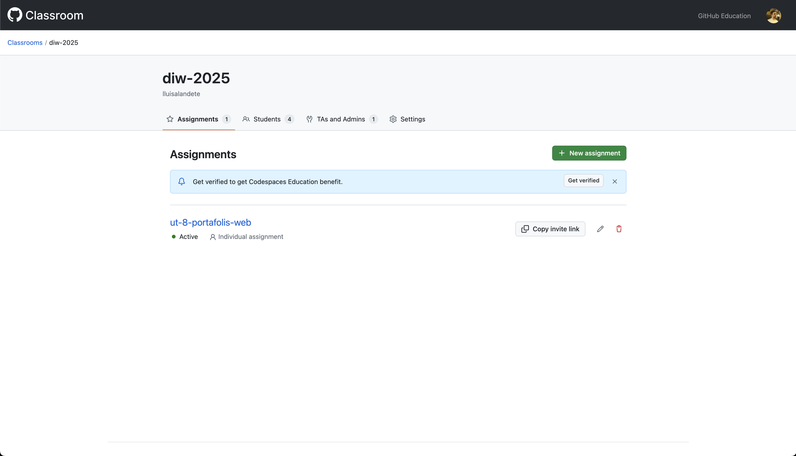
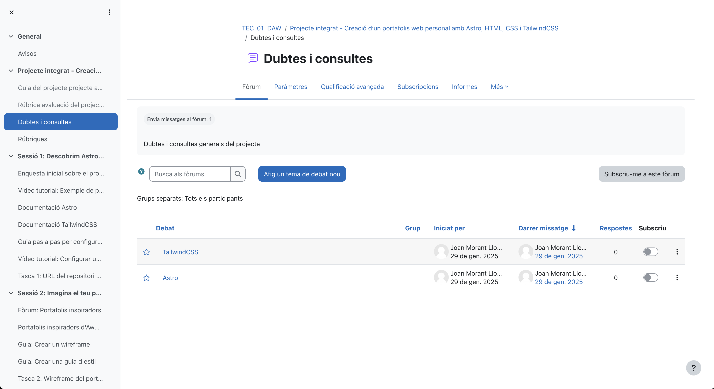

# Recursos Generats pel Professor

## Vídeos Tutorials

### 1. Sèrie "Portafolis Professional amb Astro"

**Finalitat**: Introducció i aprenentatge guiat

| Vídeo | Durada | Contingut | Eina |
|-------|--------|-----------|------|
| [Configuració Astro + Tailwind](https://youtu.be/configuracio-astro) | 15 min | Setup inicial del projecte | OBS Studio |
| [Estructura HTML Semàntica](https://youtu.be/html-semantic) | 20 min | Header, main, footer accessibles | Loom |
| [Disseny Responsive amb Tailwind](https://youtu.be/responsive-tailwind) | 25 min | Mobile-first, breakpoints | Camtasia |
| [Optimització d'Imatges](https://youtu.be/optimitzacio-imatges) | 12 min | Formats WebP, lazy loading | OBS Studio |
| [Desplegament AWS amb Docker](https://youtu.be/deploy-aws-docker) | 25 min | Containerització i ECS deployment | Loom |

### 2. Píldores Formatives

**Finalitat**: Reforç i resolució de dubtes

- [Debugging CSS amb DevTools](https://youtu.be/debug-css) - 8 min
- [Accessibilitat: ARIA Labels](https://youtu.be/aria-labels) - 10 min  
- [Git: Bones Pràctiques](https://youtu.be/git-practices) - 15 min
- [Lighthouse: Interpretació de Resultats](https://youtu.be/lighthouse-results) - 12 min

## Presentacions Interactives

### 1. Material Introductori

**Presentació Principal**: [Portafolis Web Modern](https://slides.com/profesor/portafolis-web)
- **Eina**: Slides.com amb integració Figma
- **Finalitat**: Motivació i contextualització inicial
- **Contingut**: Exemples inspiradors, mercat laboral, objectives

### 2. Guies Visuals

**Guia d'Estil**: [Design System Exemple](https://www.figma.com/design-system-exemple)
- **Eina**: Figma
- **Finalitat**: Plantilla i referència visual
- **Contingut**: Colors, tipografies, components, espaciats

## Formularis d'Avaluació

### 1. Autoavaluació Setmanal

**Enllaç**: [Formulari Reflexió](https://forms.microsoft.com/r/autoavaluacio)
- **Eina**: Microsoft Forms
- **Finalitat**: Seguiment de l'aprenentatge
- **Freqüència**: Setmanal (divendres)

### 2. Coavaluació QA

**Enllaç**: [Peer Review Form](https://forms.microsoft.com/r/peer-review)
- **Eina**: Microsoft Forms
- **Finalitat**: Feedback entre iguals estructurat
- **Moments**: Sessions 8 i 10

### 3. Enquesta de Satisfacció

**Enllaç**: [Valoració del Projecte](https://forms.microsoft.com/r/valoracio-projecte)
- **Eina**: Microsoft Forms
- **Finalitat**: Millora contínua de la unitat
- **Moment**: Final del projecte

## Materials Didàctics Originals

### 1. Plantilles de Codi

**Repositori Base**: [Astro Starter Template](https://github.com/professor/astro-portfolio-starter)
- **Eina**: GitHub Template Repository
- **Finalitat**: Accelerar l'inici del projecte
- **Contingut**: Estructura bàsica, configuració, exemples

### 2. Checklists Interactives

**Checklist de Desenvolupament**: [Notion Checklist](https://notion.so/checklist-desenvolupament)
- **Eina**: Notion
- **Finalitat**: Guia pas a pas i autoavaluació
- **Sections**: Planificació, desenvolupament, testing, desplegament

### 3. Guies Escrites

**Guia Completa**: [Manual del Projecte](./index.md)
- **Eina**: Markdown + MkDocs
- **Finalitat**: Referència completa offline
- **Contingut**: Tots els aspectes tècnics i metodològics

## Recursos Interactius

### 1. Simuladors i Demos

**Demo Interactiva**: [Exemple Portafolis](http://portafolis-alb-123456789.us-east-1.elb.amazonaws.com)
- **Eina**: Astro + Docker + AWS ECS
- **Finalitat**: Model de referència
- **Característiques**: Codi obert, arquitectura cloud, comentaris explicatius

### 2. Jocs Educatius

**Quiz Accessibilitat**: [Kahoot WCAG](https://kahoot.it/challenge/wcag-quiz)
- **Eina**: Kahoot
- **Finalitat**: Gamificació de l'aprenentatge
- **Moment**: Introducció a accessibilitat

### 3. Simuladors de Desplegament

**Sandbox Environment**: [CodeSandbox Template](https://codesandbox.io/astro-portfolio)
- **Eina**: CodeSandbox
- **Finalitat**: Proves ràpides sense configuració local
- **Ús**: Debugging, experimentació

## Eines de Seguiment

### 1. Dashboard Gestió de tasques

**Plataforma**: Microsoft Planner
- **Finalitat**: Seguiment del progrés individual i grupal
- **Mètriques**: Tasques completades, temps invertit, qualitat

### 2. Repositori de Recursos

**Organització**: [GitHub Classroom](https://classroom.github.com/classrooms/215906397-diw-2025)
- **Finalitat**: Gestió centralitzada de projectes
- **Funcions**: Assignació automàtica, feedback inline, notes

### 3. Comunicació

**Canal Principal**: Fòrum Moodle "DIW - Portafolis"
- **Finalitat**: Resolució de dubtes i debat col·laboratiu
- **Seccions**: General, Suport Tècnic, Mostra de Treballs, Recursos

## Estadístiques d'Ús

### Engagement amb Recursos

- **Vídeos**: 95% visualització completa
- **Formularis**: 88% participació setmanal
- **Repositori**: 100% forks actius

### Feedback de l'Alumnat

- **Vídeos**: 4.7/5 utilitat
- **Presentacions**: 4.5/5 claredat
- **Formularis**: 4.3/5 rellevància
- **Materials**: 4.8/5 qualitat 